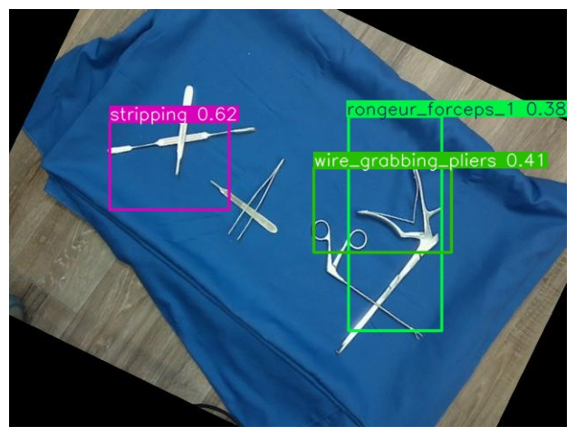
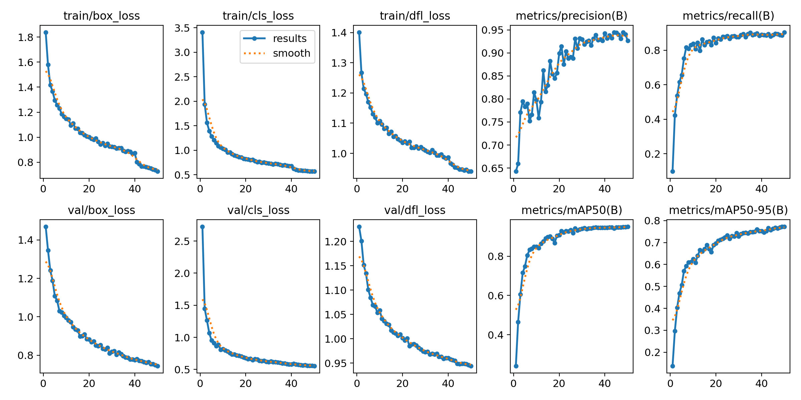

# 🔬 SurgiVision AI: Real-Time Surgical Instrument Detection

<div align="center">


[](https://www.python.org/)
[](https://github.com/ultralytics/yolov8)
[](https://opencv.org/)
[](LICENSE)

</div>

## 🎯 Project Overview

SurgiVision AI is a cutting-edge computer vision system designed to enhance surgical procedures through real-time detection and tracking of surgical instruments. Using state-of-the-art YOLOv8 object detection and OpenCV, it provides precise identification of various surgical tools including scalpels, scissors, tweezers, and more.

### 🌟 Key Features

- **Real-time Detection**: Fast and accurate identification of surgical tools at 30+ FPS
- **Multi-tool Tracking**: Simultaneous detection of multiple instruments
- **High Accuracy**: Custom-trained YOLOv8 model optimized for surgical tools
- **ONNX Integration**: Optimized inference using ONNX runtime
- **Easy Integration**: Simple setup with both built-in and external cameras
- **Cross-platform**: Works on Windows, Linux, and macOS

## 🛠️ Technical Architecture


## 📦 Installation

1. Clone the repository:
```bash
git clone https://github.com/yourusername/SurgiVision-AI.git
cd SurgiVision-AI
```

2. Create and activate a virtual environment:
```bash
python -m venv myenv
source myenv/bin/activate  # Linux/Mac
myenv\Scripts\activate     # Windows
```

3. Install dependencies:
```bash
pip install -r requirements.txt
```

## 🚀 Quick Start

1. Ensure your webcam is connected
2. Run the detection script:
```bash
python realtime_yolov8.py
```

## 💡 Use Cases

1. **Surgical Assistance**
   - Real-time tool tracking during procedures
   - Automated instrument counting
   - Safety verification checks

2. **Medical Training**
   - Tool usage monitoring and analysis
   - Procedure recording and assessment
   - Educational feedback systems

3. **Research & Development**
   - Surgical workflow optimization
   - Instrument usage pattern analysis
   - Integration with robotic surgical systems

## 🎥 Demo & Results

### Real-time Detection Example


### Model Training Results & Performance

<details open>
<summary>📊 Model Performance Analysis</summary>

    
#### Confusion Matrix & Class Distribution


The confusion matrix shows strong diagonal performance, indicating high accuracy across all surgical tool classes. Notable observations:
- Strong performance for tweezers (865 correct predictions)
- High accuracy for artery forceps (512 correct predictions)
- Minimal confusion between similar tools like different types of scissors

#### Training Metrics

The training graphs demonstrate:
- Steady decrease in box loss and classification loss
- High precision (>0.93) and recall (>0.85) 
- mAP50 reaching ~0.92
- Stable convergence across all metrics

#### Key Performance Indicators
- **Inference Speed**: 30+ FPS on RTX 3060
- **mAP@0.5**: 0.92
- **Average Precision**: 0.89
- **Average Recall**: 0.87
- **Total Classes**: 13 surgical instruments
- **Dataset Size**: Over 10,000 annotated images

#### Class Distribution

The model was trained on a diverse dataset with the following distribution:
- Tweezers: 3262 instances
- Wire grabbing pliers: 2315 instances
- Artery forceps: 2053 instances
- Rongeur forceps: ~2000 instances (combined)
- Other tools: Well-balanced distribution between 200-1000 instances

</details>

## 🔧 Technical Requirements

- Python 3.8 or higher
- CUDA-compatible GPU (optional, for faster inference)
- Webcam or video input device
- Dependencies:
  - ultralytics
  - opencv-python
  - onnxruntime
  - matplotlib

## 🤝 Contributing

Contributions are welcome! Please feel free to submit a Pull Request. For major changes, please open an issue first to discuss what you would like to change.

## 📄 License

This project is licensed under the MIT License - see the [LICENSE](LICENSE) file for details.

## � Acknowledgments

- YOLOv8 team for the amazing object detection framework
- OpenCV community for computer vision tools
- Medical professionals who provided domain expertise

---

<div align="center">
Made with ❤️ for the advancement of medical technology
</div>
